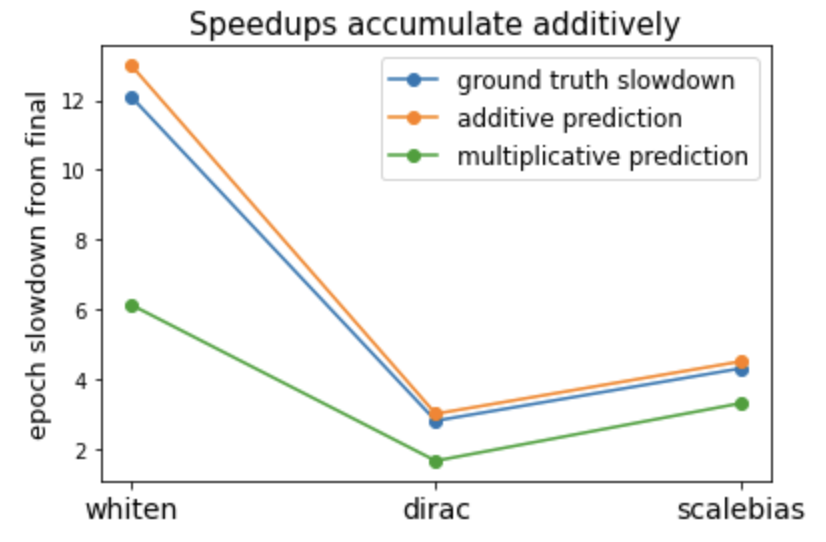

# Airbench ablations

The final `airbench.py` (== `main8_compile.py`) is built from the following accumulating series of features.

Each script in the series adds a feature to the previous one.

Our network architecture is the same as that in [hlb-cifar10](https://github.com/tysam-code/hlb-CIFAR10), with the following changes.
1. We put BatchNorms in fp32 because this results in faster epochs than putting them in fp16.
2. We replace the custom MaxPool at the end with nn.MaxPool2d(3).
3. We reduce the final block width from 512 to 256.
4. We add a learnable bias to the first conv layer.

Runtimes are measured in seconds on a single NVIDIA A100. Each script attains slightly over 94% accuracy.

| Script | Feature | Time | PFLOPs | Epochs |
| - | - | - | - | - |
| `main0_network.py` | Trains with standard initialization, Nesterov SGD and data augmentation. Evaluates with random-flip TTA. | 14.2 | 1.22 | 34.0 |
| `main1_whiten.py` | Initializes first conv layer as whitening transform & removes proceeding BatchNorm. | 8.6 | 0.76 | 21.0 |
| `main2_dirac.py` | Initializes all other conv layers as (partly) identity transforms. | 7.3 | 0.65 | 18.0 |
| `main3_scalebias.py` | Scales up the learning rate for BatchNorm biases by 64x. | 5.5 | 0.49 | 13.5 |
| `main4_freeze.py` | Freezes first conv layer bias after 3 epochs. | 5.2 | 0.47 | 13.5 |
| `main5_lookahead.py` | Adds lookahead / EMA-based optimization scheme from hlb-cifar10. | 4.6 | 0.42 | 12.0 |
| `main6_tta.py` | Evaluates with extra multi-crop TTA. | 4.3 | 0.39 | 10.8 |
| `main7_mirror.py` | Replaces the standard random-flip data augmentation with a semi-deterministic alternating flip method. | 3.9 | 0.36 | 9.9 |
| `main8_compile.py` | Compiles model with `torch.compile`. This is the final version. | 3.5 | 0.36 | 9.9 |

---
Note: lookahead only helps when combined with fast BatchNorm momentum, and vice versa.

Feature categories:
* Initialization: `whiten`, `dirac`
* Optimization: `scalebias`, `freeze`, `lookahead`
* Evaluation: `tta`
* Data distribution: `mirror`

### Baselines
| Script | Feature | Time | PFLOPs | Epochs |
| - | - | - | - | - |
| [hlb-cifar10](https://github.com/tysam-code/hlb-CIFAR10) | Hyperlightspeedbench -- fast training script & and prev record holder | 6.2 | 0.60 | 12.1 |
| [cifar10-fast](https://github.com/davidcpage/cifar10-fast) | Fast training script as described in [How to Train Your ResNet](https://myrtle.ai/learn/how-to-train-your-resnet/) | 14.9 | 1.14 | 10.0 |
| `train_resnet18.py` | ResNet-18 training script optimized for time-to-94% | 52.1  | 4.35 | 26.0 |

### Further ablations
| Script | Feature | Time | PFLOPs | Epochs |
| - | - | - | - | - |
| `main9a_nowhiten.py` | Includes all features except for the initial whitening layer. | 9.3 | 0.78 | 22.0 |
| `main9b_nodirac.py` | Includes all features except for identity initialization of conv layers. | 5.0 | 0.46 | 12.7 |
| `main9c_noscalebias.py` | Includes all features except for scaling up of BN bias learning rate. | 5.6 | 0.51 | 14.2 |
| `main9e_whiten_mirror.py` | Includes only whitening transform and alternating flip. | 8.2 | 0.72 | 20.0 |
| `main9f_whiten_tta.py` | Includes only whitening transform and multi-crop TTA. | 7.5 | 0.66 | 18.1 |

